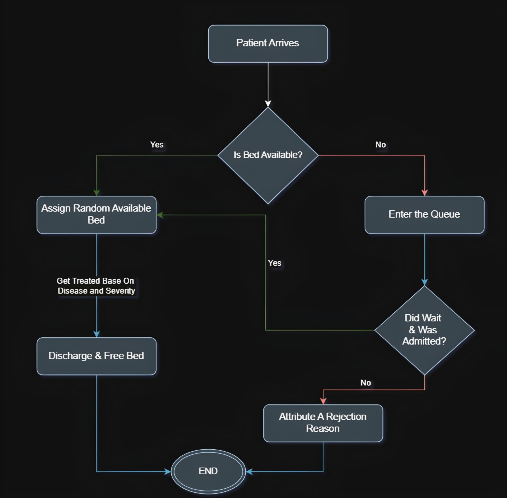

# Hospital Simulation

This document outlines the operational rules for the hospital simulation implemented in the Jupyter notebook. The rules govern patient arrivals, evaluation, bed allocation, queue management, rejection criteria, discharge, system monitoring, and visualization. The `patient_flow` function is the core component managing patient admission, and detailed explanations highlight its role.

# Table of Contents
1. [Hospital Rules](#hospital-rules)
   1. [Patient Arrival](#1-patient-arrival)
   2. [Patient Evaluation](#2-patient-evaluation)
   3. [Bed Allocation](#3-bed-allocation)
   4. [Queue Management](#4-queue-management)
   5. [Rejection Criteria](#5-rejection-criteria)
   6. [Discharge](#6-discharge)
   7. [System Monitoring](#7-system-monitoring)
   8. [Visualization and Statistical Plots](#8-visualization-and-statistical-plots)
2. [Patient Admission Flowchart](#patient-admission-flowchart)

## Hospital Rules

### 1. Patient Arrival
- **Frequency**: Patients arrive at random intervals between 1 and 3 hours, controlled by the `patient_generator` function, which schedules new patient processes.
- **Age Groups**: Patients are assigned to one of five age groups with the following probabilities:
  - 0-18: 15%
  - 19-35: 25%
  - 36-55: 35%
  - 56-75: 15%
  - 76+: 10%
- **Diseases**: Patients are diagnosed with one of five diseases, each with subtypes, base severity, and treatment duration ranges (12–24 hours):
  - Broken Arm: 12–24 hours
  - Concussion: 18–24 hours
  - Simple Fracture: 12–18 hours
  - Appendicitis: 12–24 hours
  - Pneumonia: 18–24 hours
- **Role in Simulation**: The `patient_generator` function triggers the `patient_flow` function for each arriving patient, passing the simulation environment, bed resources, and patient records list.

### 2. Patient Evaluation
- **Overview**: The `patient_flow` function initiates patient evaluation by creating a patient and determining their wait time for assessment.
- **Process in `patient_flow`**:
  - **Patient Creation**: Randomly selects an age group and disease, then calls `create_patient` to generate a patient record with attributes like `severity_score`, `priority_level`, vital signs (`bp`, `pulse`, `temp`), and `medical_factors` (e.g., `'adult,fever'`).
  - **Severity Score Calculation**: Based on:
    - Disease base severity (e.g., 4 for Pneumonia) and subtype severity (e.g., +1 for Moderate).
    - Vital signs: Blood pressure > 160 or < 100 adds 0.5; temperature > 38°C adds 0.5.
    - Age group factors (e.g., comorbidities for elderly).
  - **Priority Level**: Computed as a weighted combination of `severity_score` (60%) and age group priority (40%), influencing wait time.
  - **Evaluation Wait Time**: Determined by:
    ```python
    base_wait = max(0.1, 4 - (patient['priority_level'] / 2))
    wait_time = random.uniform(base_wait / 2, base_wait * 1.5)
    ```
    - Higher priority reduces `base_wait`, resulting in `wait_time` ranging from 0.1 to ~6 hours.
    - Example: For `priority_level = 3`, `base_wait = 2.5`, `wait_time` is 1.25–3.75 hours.
    - Stored as `evaluation_time_min` (in minutes, e.g., 2 hours → 120 minutes).
- **Purpose**: Simulates the initial assessment phase, prioritizing higher-severity or higher-priority patients to reduce wait times and increase admission likelihood.

### 3. Bed Allocation
- **Overview**: The `patient_flow` function manages bed allocation by requesting a bed, handling admission delays, and assigning an available bed if possible.
- **Process in `patient_flow`**:
  - **Bed Request**: Uses `beds.request()` to request one of the hospital’s beds (default capacity: 10). If a bed is available, it’s allocated immediately; otherwise, the patient enters the queue.
    - Waits 0.1–0.5 hours for initial processing, then yields until either the bed is allocated or `wait_time` expires.
  - **Admission Delay**: If a bed is secured (`request in result`), waits an additional 0.2–1.0 hours to simulate administrative processing
    - Stored as `admission_delay_min` (in minutes, e.g., 0.5 hours → 30 minutes).
  - **Bed Assignment**: Checks `beds.bed_status` for available beds (marked `'available'`). If found, assigns a random bed:
    - Updates `patient` with `status = 'admitted'`, `bed_number` (integer), and discharge details.
- **Purpose**: Allocates beds to patients who secure a request, ensuring efficient use of resources while accounting for processing delays.

### 4. Queue Management  
- **Overview**: The `patient_flow` function manages queue dynamics when no beds are available, allowing patients to wait temporarily or rejecting them if their wait time expires.  
- **Process in `patient_flow`**:  
  - **Queue Entry**: If all beds are occupied (`beds.count == beds.capacity`), the `beds.request()` places the patient in a queue. 
  - **Wait in Queue**: Patients wait up to `wait_time` (0.1–6 hours, priority-based) for a bed. The queue advances as beds are freed by discharged patients.  
  - **Timeout Rejection**: If no bed becomes available before `wait_time` expires (`request not in result`), the patient is rejected (see *Rejection Criteria*).  
- **Key Assumption**: The queue never reaches full capacity (5 patients); in practice, it holds ≤3 patients. Thus, explicit "queue full" rejections are unnecessary.  
- **Purpose**: Acts as a temporary buffer for patients when beds are unavailable, increasing admission chances without strict capacity-based rejections.  

### 5. Rejection Criteria
- **Overview**: The `patient_flow` function determines when and why patients are rejected, using probabilistic reasoning to assign rejection reasons.
- **Process in `patient_flow`**:
  - **Conditions for Rejection**:
    - **Wait Time Expiry**: If the bed request times out (`request not in result`), the patient is rejected because no bed became available within `wait_time`.
  - **Rejection Reasons for Timeout**:
    - If the request fails due to timeout, probabilities are assigned:
      ```python
      rejection_reasons = {
          'low_priority': 0.6 - (patient['priority_level'] * 0.1),
          'non_urgent': 0.3 if patient['severity_score'] < 3 else 0.1,
          'resource_constraints': 0.4 if beds.count / beds.capacity > 0.9 else 0.1,
          'transfer_recommended': 0.2 if patient['severity_score'] > 5 else 0
      }
      probable_reasons = {k: v for k, v in rejection_reasons.items() if random.random() < v}
      rejection_reason = max(probable_reasons.items(), key=lambda x: x[1])[0] if probable_reasons else 'capacity'
      ```
    - **Low Priority**: Higher probability for lower `priority_level` (e.g., 0.3 for `priority_level = 3`).
    - **Non-Urgent**: Higher for `severity_score < 3` (0.3 vs. 0.1).
    - **Resource Constraints**: Higher when bed utilization > 90% (0.4 vs. 0.1).
    - **Transfer Recommended**: Applies for `severity_score > 5` (0.2).
    - **Capacity**: Default if no other reason is selected.
    - Example: For `priority_level = 3`, `severity_score = 4`, 9/10 beds used, probabilities might select `'resource_constraints'` (0.4).
  - **Patient Update**: Sets `status = 'rejected'`, assigns `rejection_reason`, and appends to `patient_records`.
- **Purpose**: Ensures realistic rejection scenarios, prioritizing patients based on severity and system load, and provides detailed rejection reasons for analysis.

### 6. Discharge
- **Overview**: The `patient_flow` function concludes the process for admitted patients by simulating treatment and freeing the assigned bed.
- **Process in `patient_flow`**:
  - **Treatment Simulation**: Waits for the patient’s `treatment_duration` (12–24 hours, adjusted by severity):
    ```python
    yield env.timeout(patient['treatment_duration'])
    ```
  - **Bed Release**: Marks the bed as available:
    ```python
    beds.bed_status[bed_number] = 'available'
    ```
  - **Record Keeping**: The patient’s `discharge_timestamp` (in `HH:MM:SS`) is set during admission, stored in `patient_records` for the final `df_patients`.
- **Purpose**: Completes the patient’s hospital stay, ensuring beds are recycled for new patients, and records discharge details.

### 7. System Monitoring
- **Frequency**: The `monitor_system` function records system state hourly, independent of `patient_flow`.
- **Metrics**:
  - Number of occupied and available beds (derived from `beds.bed_status`).
  - Queue length and state (‘full’ if at maximum capacity, else ‘available’).
  - System state (‘overcapacity’ if beds used + queue length > bed capacity, else ‘normal’).
  - Bed utilization (occupied beds / total beds).
- **Interaction with `patient_flow`**: The `patient_flow` function’s updates to `beds.bed_status` and queue usage feed into these metrics, tracked in `df_hourly`.

### 8. Visualization and Statistical Plots
- **Overview**: The simulation includes an animation and four statistical plots to visualize hospital operations and patient outcomes, using data from `df_patients` and `df_hourly`. These visualizations help understand bed usage, patient flow, and system performance.
- **Bed Allocation Animation**:
  - **Description**: A dynamic animation shows bed occupancy and queue status over time. Beds are represented as rectangles (red for occupied, green for available), queue positions as yellow dots, and text displays the current hour, day, occupancy, queue length, and number of rejected patients.
  - **Purpose**: Visualizes how beds are allocated and freed, highlighting busy periods and queue dynamics. Useful for observing real-time hospital resource management.

## Patient Admission Flowchart

The flowchart illustrating the patient admission process, managed by the `patient_flow` function.

 


